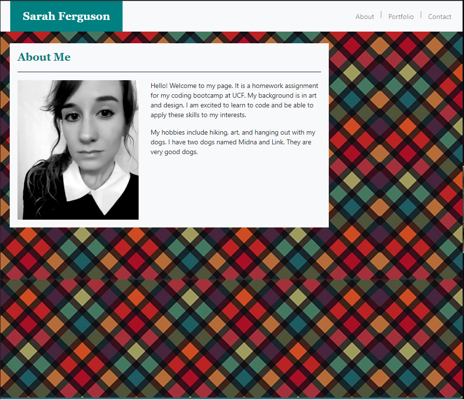

# BootstrapSite

This website is a homework assignment using Bootstrap to create a responsive portfolio page. I used Bootstrap with CSS and HTML to create a site where the format changes according to screen size. 

##

The website is 

https://saarahah.github.io/BootstrapSite/index.html

<<<<<<< HEAD
=======

>>>>>>> c0633fb864ceb2e54120afe934f12c82f52a6eb7
